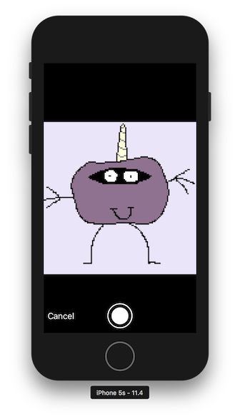

# MockImagePicker

Mock UIImagePickerController to simulate the camera in iOS simulator.

[![Swift Version][swift-image]][swift-url]
[![Build Status][travis-image]][travis-url]
[![License][license-image]][license-url]
[](https://img.shields.io/cocoapods/v/MockImagePicker.svg)  
[](http://cocoapods.org/pods/MockImagePicker)
[](http://makeapullrequest.com)

## Usage

```swift
#if targetEnvironment(simulator)
    import MockImagePicker
    typealias UIImagePickerController = MockImagePicker
    typealias UIImagePickerControllerDelegate = MockImagePickerDelegate
#endif
```

## Requirements

- iOS 9.3+
- Xcode 9

## Installation

### CocoaPods:

```ruby
pod 'MockImagePicker'
```

Legacy versions:

| Swift version | MockImagePicker version |
| :---: | :--- |
| 4.1 (Xcode 9.4) | `pod 'MiniLayout', '~> 1.2.1'`<br>`pod 'MockImagePicker', '~> 1.1.0'` |

### Swift Package Manager:

```swift
dependencies: [
    .package(url: "https://github.com/yonat/MockImagePicker", from: "1.2.5")
]
```

## TODO

- [ ] implement `cameraOverlayView`

## Meta

[@yonatsharon](https://twitter.com/yonatsharon)

[https://github.com/yonat/MockImagePicker](https://github.com/yonat/MockImagePicker)

[swift-image]:https://img.shields.io/badge/swift-4.2-orange.svg
[swift-url]: https://swift.org/
[license-image]: https://img.shields.io/badge/License-MIT-blue.svg
[license-url]: LICENSE.txt
[travis-image]: https://img.shields.io/travis/dbader/node-datadog-metrics/master.svg?style=flat-square
[travis-url]: https://travis-ci.org/dbader/node-datadog-metrics
[codebeat-image]: https://codebeat.co/badges/c19b47ea-2f9d-45df-8458-b2d952fe9dad
[codebeat-url]: https://codebeat.co/projects/github-com-vsouza-awesomeios-com
